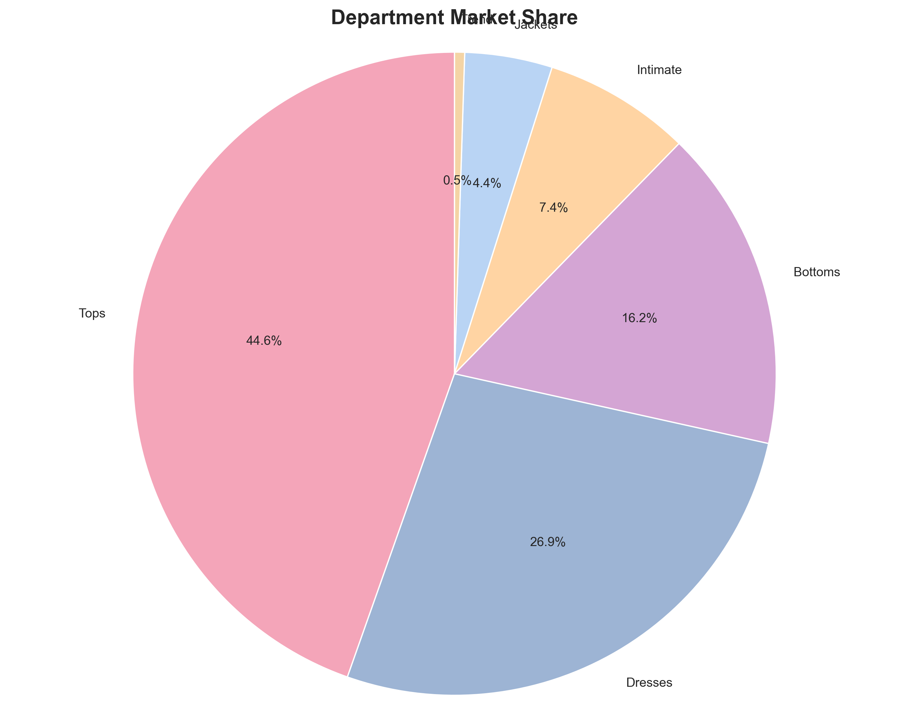
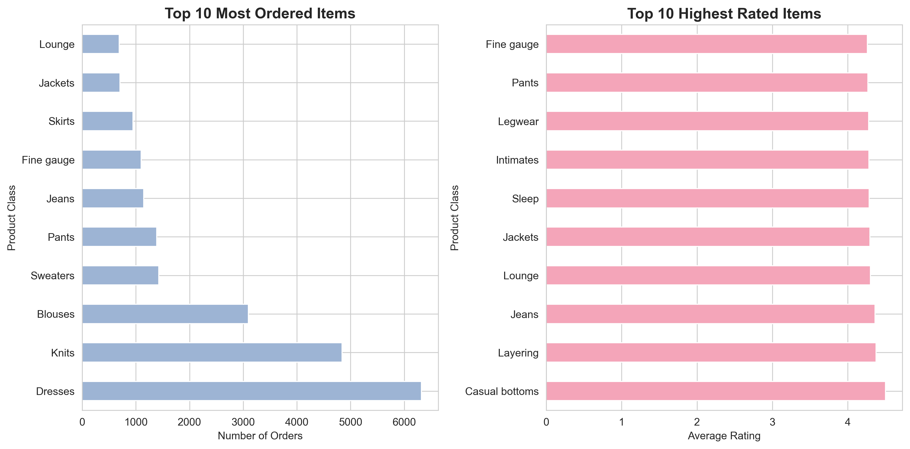

# Fashion E-Commerce Customer Analysis 👗📊

A data analytics project analyzing 23,000+ customer reviews to uncover purchasing patterns, customer preferences, and actionable business insights for an online women's clothing retailer.


---

## 📋 Project Overview

This project examines customer behavior, product performance, and demographic trends in the fashion e-commerce industry using data analysis and visualization techniques. The analysis reveals critical insights about customer satisfaction, product preferences across age groups, and department performance.

**Key Question:** What drives customer satisfaction and purchasing decisions in online fashion retail?

---

## 🎯 Key Findings

### Customer Demographics
- **Primary segment:** 36-45 age group (31.5% of customers)
- **Age range:** 18-99 years, showing broad market appeal
- **Smallest segment:** 18-25 (5.2%) - significant growth opportunity

### Product Performance
- **Most ordered:** Dresses (6,000+ orders)
- **Highest rated:** Casual Bottoms (4.6+ average rating)
- **Key insight:** High sales volume does not equal high customer satisfaction

### Department Analysis
- **Top performers:** Tops (44.6%) + Dresses (26.9%) = 71.5% of business
- **Underperforming:** Trend department (0.5%) and Jackets (4.4%)
- **Universal appeal:** Tops dominate across all age groups



---

## 💡 Business Recommendations

### Immediate Actions
1. **Investigate Dress Quality** - High sales volume but lower satisfaction ratings indicate potential fit or quality issues
2. **Market Casual Bottoms Better** - Excellent customer ratings but low sales volume suggests untapped marketing opportunity
3. **Re-evaluate Trend Department** - Critical underperformance at 0.5% market share requires strategic review

### Growth Opportunities
4. **Target Young Adults (18-25)** - Smallest segment at 5.2% represents untapped market potential
5. **Optimize for Core Demographic (36-45)** - Double down on strategies that resonate with primary customer base
6. **Promote Hidden Gems** - Items like Layering pieces show high satisfaction but lack visibility

---

## 🛠️ Tools & Technologies

- **Programming:** Python 3.11
- **Data Analysis:** Pandas, NumPy
- **Visualization:** Matplotlib, Seaborn
- **Statistical Analysis:** Scipy
- **Environment:** Jupyter Notebook

---

## 📊 Visualizations

### Volume vs. Satisfaction Analysis


*Side-by-side comparison reveals the disconnect between what sells most and what customers rate highest*

### Department Preferences by Age Group


*Analysis shows Tops dominate across all demographics, with the 36-45 age group driving the highest volume*

---

## 📁 Project Structure
```
fashion-ecommerce-analysis/
│
├── README.md                          # Project documentation
├── fashion_analysis.ipynb             # Main analysis notebook
├── data/                              # Dataset folder
│   └── Womens Clothing Reviews.xlsx
└── images/                            # Visualization exports
    ├── volume_vs_rating.png
    ├── dept_by_age.png
    └── market_share.png
```

---

## 🚀 Getting Started

### Prerequisites
```bash
pip install pandas numpy matplotlib seaborn openpyxl scipy
```

### Running the Analysis
1. Clone this repository
```bash
git clone https://github.com/BerylOdoyo/fashion-ecommerce-analysis.git
cd fashion-ecommerce-analysis
```

2. Open Jupyter Notebook
```bash
jupyter notebook fashion_analysis.ipynb
```

3. Run all cells to reproduce the analysis

---

## 📈 Methodology

1. **Data Cleaning:** Handled missing values, removed 14 incomplete records (<0.1% of data)
2. **Customer Segmentation:** Created age groups for demographic analysis
3. **Exploratory Analysis:** Generated visualizations to identify purchasing patterns
4. **Statistical Analysis:** Calculated distributions, percentages, and group comparisons
5. **Business Insights:** Translated data findings into actionable business recommendations

---

## 📝 Dataset Information

- **Source:** Kaggle - Women's E-Commerce Clothing Reviews
- **Records:** 23,472 (after cleaning from 23,486 original records)
- **Features:** Customer Age, Product Rating, Review Text, Department, Class Name, Division
- **Scope:** Historical customer reviews from online fashion retailer

---

## 🎓 Learning Outcomes

Through this project, I developed practical skills in:
- Data cleaning and preprocessing of messy real-world data
- Customer segmentation and demographic analysis
- Statistical analysis and calculating key business metrics
- Creating effective data visualizations for storytelling
- Translating technical findings into business recommendations
- Professional documentation and GitHub project management

---

## 👤 Author

**Beryl Achieng Odoyo**
- 📧 Email: odoyoberyl1@gmail.com
- 📍 Location: Nairobi, Kenya
- 💼 Seeking: Entry-level opportunities in Data Analysis, Business Analysis, or IT Support

---

## 🙏 Acknowledgments

- Dataset provided by the Kaggle community
- Project inspired by real-world e-commerce analytics challenges
- Completed as part of continuous learning and portfolio development in data analytics

---

## 📄 License

This project is open source and available for educational purposes.

---

*Project completed: January 2026*
*Last updated: January 2026*